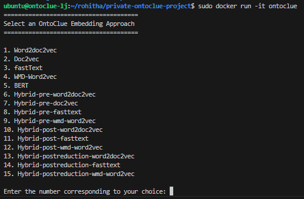
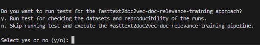
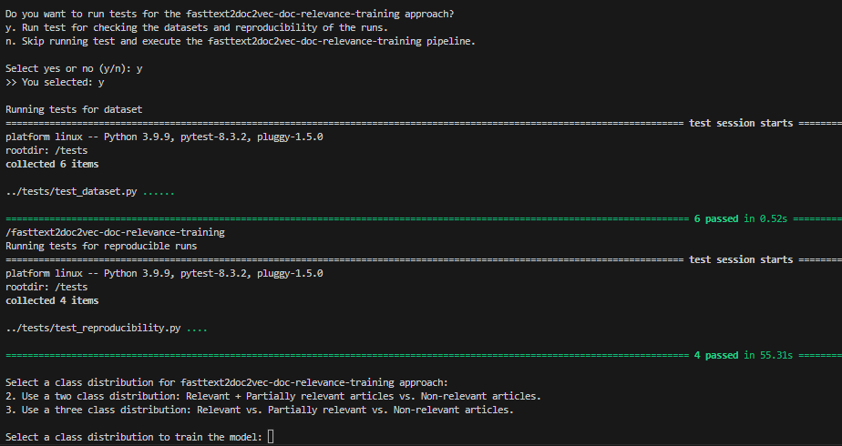

# Docker Container for OntoClue

This repository contains the code for the Docker container for OntoClue. 

## About OntoClue

OntoClue is a project that explores various embedding approaches to assess document-to-document similarity using the RELISH Corpus. [RELISH](https://academic.oup.com/database/article/doi/10.1093/database/baz138/5871485?login=false) is an expert-curated database designed for benchmarking document similarity in biomedical literature and consists of PubMed IDs (PMIDs) with their expert curated corresponding document-2-document relevance assessments wrt other PMIDs. Relevance is categorized as "relevant", "partial" or "irrelevant".

This project consists of several approaches, each with detailed explanations and documentation. These approaches can be executed individually by following the instructions provided in their respective repositories.

1. [Word2doc2vec](https://github.com/zbmed-semtec/word2doc2vec-doc-relevance-training)
2. [Doc2vec](https://github.com/zbmed-semtec/doc2vec-doc-relevance-training)
3. [fastText](https://github.com/zbmed-semtec/fasttext2doc2vec-doc-relevance-training)
4. [WMD-Word2vec](https://github.com/zbmed-semtec/wmd-word2vec-training)
5. [BERT]()
6. [Hybrid-pre-word2doc2vec](https://github.com/zbmed-semtec/hybrid-doc-relevance-training/tree/dev/code/pre/word2doc2vec)
7. [Hybrid-pre-doc2vec](https://github.com/zbmed-semtec/hybrid-doc-relevance-training/tree/dev/code/pre/doc2vec)
8. [Hybrid-pre-fasttext](https://github.com/zbmed-semtec/hybrid-doc-relevance-training/tree/dev/code/pre/fasttext)
9. [Hybrid-pre-wmd-word2vec](https://github.com/zbmed-semtec/hybrid-doc-relevance-training/tree/dev/code/pre/wmd-word2vec)
10. [Hybrid-post-word2doc2vec](https://github.com/zbmed-semtec/hybrid-doc-relevance-training/tree/dev/code/post/word2doc2vec)
11. [Hybrid-post-fasttext](https://github.com/zbmed-semtec/hybrid-doc-relevance-training/tree/dev/code/post/fasttext)
12. [Hybrid-post-wmd-word2vec](https://github.com/zbmed-semtec/hybrid-doc-relevance-training/tree/dev/code/post/wmd-word2vec)
13. [Hybrid-postreduction-word2doc2vec](https://github.com/zbmed-semtec/hybrid-doc-relevance-training/tree/dev/code/postreduction/word2doc2vec)
14. [Hybrid-postreduction-fasttext](https://github.com/zbmed-semtec/hybrid-doc-relevance-training/tree/dev/code/postreduction/fasttext)
15. [Hybrid-postreduction-wmd-word2vec](https://github.com/zbmed-semtec/hybrid-doc-relevance-training/tree/dev/code/postreduction/wmd-word2vec)

## Dockerized version of OntoClue

The Docker container for this project ensures reproducibility of the runs, allowing for consistent training and evaluation of different neural network models on the document-to-document similarity within the RELISH Corpus. The entire pipeline can be executed with a few commands. This pipeline includes:

+ Cloning the corresponding repository for the selected approach, which contains all the necessary code.
+ Downloading the appropriate pre-processed datasets based on the chosen approach (normal text vs annotated text).
+ Running tests to verify dataset integrity and reproducibility of runs.
+ Evaluating the models.

**NOTE:** The datasets that are downloaded are already preprocessed using a preprocessing pipeline, as explained in the [relish-preprocessing](https://github.com/zbmed-semtec/relish-preprocessing) repository, and include annotated datasets as well. Documentation on [datasets](https://github.com/zbmed-semtec/relish-preprocessing), [data preprocessing](https://github.com/zbmed-semtec/relish-preprocessing), and [annotation](https://github.com/zbmed-semtec/relish-preprocessing) are also available.

## Requirements

In order to get started with the pipeline it is essential that you have Docker installed. Please follow the instructions below to install Docker.

### Setting up Docker on Linux

For Linux distribution like Ubuntu, Debian, CentOS, execute the following:

1. Update your existing list of packages:
```
sudo apt update
```

2. Install a few prerequisite packages which let apt use packages over HTTPS:
```
sudo apt install apt-transport-https ca-certificates curl software-properties-common
```


3. Add the GPG key for the official Docker repository:
```
curl -fsSL https://download.docker.com/linux/ubuntu/gpg | sudo apt-key add -
```


4. Add the Docker repository to APT sources:
```
sudo add-apt-repository "deb [arch=amd64] https://download.docker.com/linux/ubuntu focal stable"
```


5. Update the package database with the Docker packages:
```
sudo apt update
```


7. Install Docker:
```
sudo apt install docker-ce
```


## Getting Started

### 1. Clone the Repository
First, clone the repository to your local machine using the following command:

##### Using HTTP:
```
git clone https://github.com/zbmed-semtec/private-ontoclue-project.git
```

##### Using SSH:
Ensure you have set up SSH keys in your GitHub account.
```
git clone git@github.com:zbmed-semtec/private-ontoclue-project.git
```

### 2. Building the Docker Image:

Change the directory to `private-ontoclue-project` and execute the following command:
```
sudo docker build -t ontoclue .
```

### 3. Running the Docker Container:

```
sudo docker run -it ontoclue
```

### 4. Selecting Embedding Approach:

After running the container, you will be prompted to select an embedding approach:



Upon selecting an approach, the corresponding repository will be cloned from GitHub, and the appropriate datasets will be downloaded based on the chosen approach.

### 5. Running Tests [Optional]:

Once the datasets are downloaded, you will have the option to run tests. This is an optional step. These tests verify:

- If the data was downloaded to the correct directory.
- If the correct data corresponding to the selected approach was downloaded.
- Quick reproducibility checks between runs.

Depending on your preference, you can select **y** (yes) or **n** (no). You will see a prompt like this:



### 6. Selecting Class Distribution:

After the tests are completed, you will be prompted to select the class distribution. Depending on your preference, you can select **3** (three class distribution) or **2** (two class distribution).



Following this, you will see a message indicating that the pipeline is being initiated. This process will take a while to complete 100 iterations.

### 7. Acessing and Viewing Log Files:

The progress of the run is logged into files named Optuna_trials_{class_distribution}.log. Follow the steps below to view these log files and copy output files from the Docker container to your local system.

#### 1. List all containers:
First, list all running and stopped containers to find the one you need to access:
```
sudo docker ps -a
```

#### 2. Enter the container:
Access the running Docker container using its container ID:
```
sudo docker exec -it <container_id> /bin/bash
```

#### 3. View log files:
Once inside the container, view the log file associated with your specific run:

```
cat <name_of_the_approach>/output_{3/2}/Optuna_trials_{3/2}.log
```

Here, replace {3/2} with 3 for a three-class distribution or 2 for a two-class distribution.

#### 4. Output Directory

The output files are stored in:

+ `<name_of_the_approach>/output_3` for a three-class distribution.
+ `<name_of_the_approach>/output_2` for a two-class distribution.


#### 5. Copying files to your local system
To copy files from the Docker container to your local system, use the following command:

```
sudo docker cp <container_ID>:/<name_of_the_approach>/output_[3/2] <path_to_local_dir>
```
Replace the first path with the appropriate path inside the container and the second path with the destination directory on your local machine.